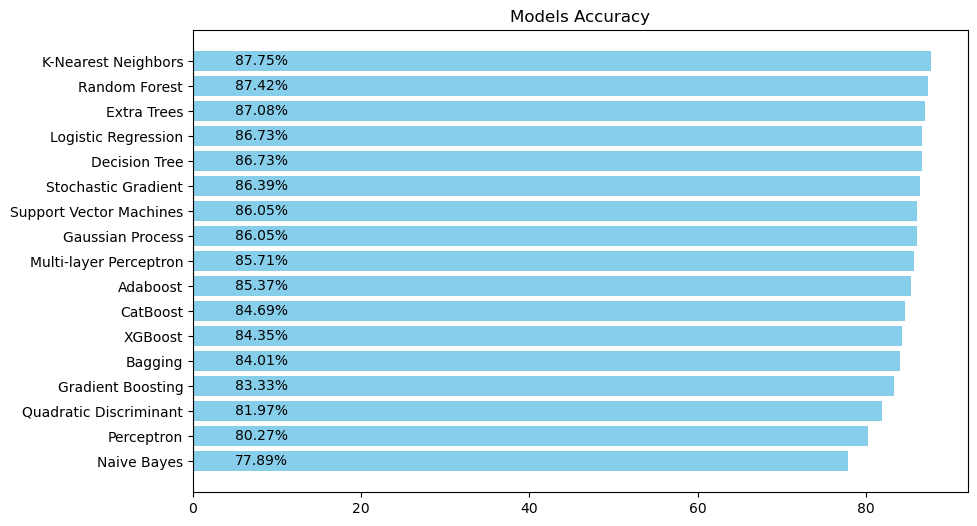
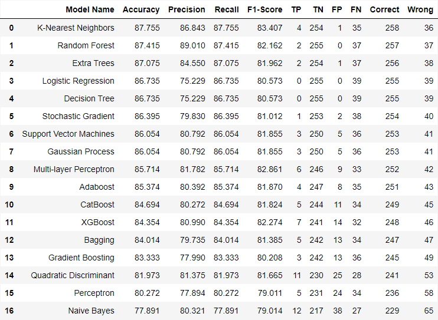

# Employee attrition, performance and retention analysis

* **[EDA Notebook on NBViewer](https://nbviewer.org/github/hmantovani/hmantovani/blob/main/IBM-HR-EN/EDA_RH_IBM.ipynb)**
* **[Modeling Notebook in NBViewer](https://nbviewer.org/github/hmantovani/hmantovani/blob/main/IBM-HR-EN/model_IBM.ipynb)**

Having the ability to hire, train and maintain a competent and qualified team of employees is one of the most important pieces within a company's scheme. To encourage its talents to remain in their current activities, the company must develop an employee retention strategy.

A company that has a well-defined strategy in this aspect creates a healthier work environment and motivates its employees to generate results. Greater regularity in the workforce can generate some benefits:

- higher quality in deliveries
- greater team engagement
- reduction in layoff expenses
- greater internal integration
- strengthening intellectual capital

This is a fictitious dataset created by IBM data scientists with diverse data from almost 1500 employees. As a company's general objective should be to maintain its talents and strengthen its intellectual capital, this analysis seeks to understand which factors lead to greater dissatisfaction on the part of employees, allowing the company to intervene in certain aspects.

- IBM HR Analytics Employee Attrition & Performance
- https://www.kaggle.com/datasets/pavansubhasht/ibm-hr-analytics-attrition-dataset

## Models by accuracy

## Full model summary

