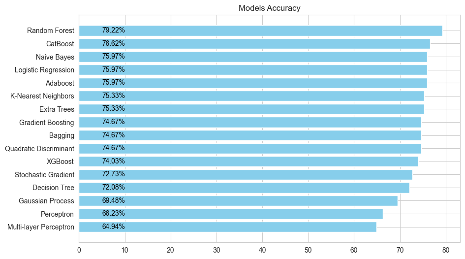
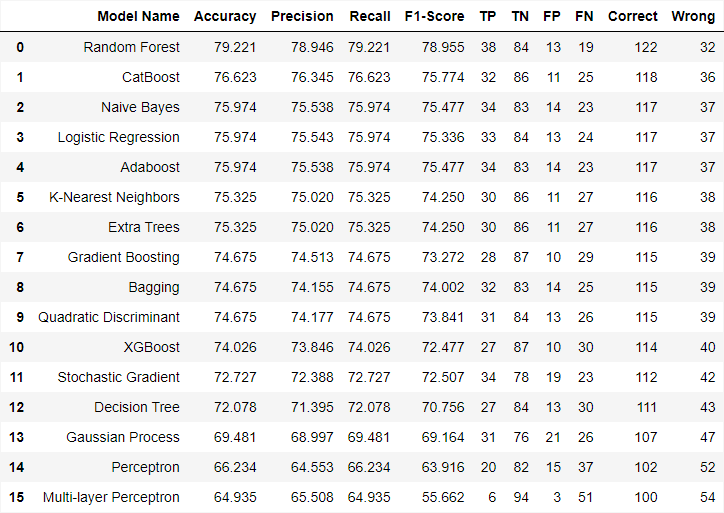

# Pima Indians Diabetes Database Analysis

## Context
This dataset is sourced from the National Institute of Diabetes and Digestive and Kidney Diseases. The primary goal is to predict whether a patient has diabetes or not based on specific diagnostic measurements. It contains information of 768 women at least 21 years old from a population near Phoenix, Arizona, USA. They are all of Pima Indian heritage, a population that has been under study by the National Institute of Diabetes and Digestive and Kidney Diseases at intervals of 2 years since 1965. In the test for Diabetes, 258 tested positive and 500 tested negative. 

## Importance of Modeling Diabetes Prediction

### Healthcare and Patient Care:
- **Early Intervention**: A predictive model aids in early detection, allowing for timely interventions and better disease management.
- **Personalized Medicine**: Tailoring treatments based on predictive models ensures more effective and personalized healthcare strategies.
- **Resource Allocation**: Hospitals can allocate resources more efficiently by identifying high-risk patients for diabetes-related complications.

### Public Health and Awareness:
- **Targeted Campaigns**: Insights from modeling help design targeted public health campaigns for preventive measures and lifestyle modifications.
- **Policy Decisions**: Policymakers can use this information to implement effective public health policies.

### Research and Innovation:
- **Understanding Risk Factors**: Modeling helps identify various risk factors, driving further research into disease prevention.
- **Innovation**: Insights can guide the development of innovative medical technologies for diabetes management.

### Ethical Considerations:
- **Informed Decision-making**: Models empower individuals to make informed decisions about their health.
- **Privacy and Confidentiality**: Ensuring patient data privacy and confidentiality is crucial in healthcare.

## Model Performance Summary and Insights

The analysis of multiple machine learning models applied to the Pima Indians Diabetes dataset has provided valuable insights into their predictive performance. The dataset, sourced from the National Institute of Diabetes and Digestive and Kidney Diseases, encompasses diagnostic measurements of 768 women of Pima Indian heritage, aimed at predicting the presence of diabetes.

### Key Findings:

1. **Random Forest**
   - *Accuracy*: 79.22%
   - *Strengths*: Balanced performance across precision, recall, and F1-score.
   - *Weaknesses*: Moderate false negatives (19), potentially impacting sensitivity.

2. **CatBoost**
   - *Accuracy*: 76.62%
   - *Observations*: Competitive precision and recall, slightly lower than Random Forest.
   - *Limitations*: Notable false negatives (25), affecting correct identification of positive cases.

3. **Naive Bayes, Logistic Regression, AdaBoost**
   - *Performance*: Similar accuracy, precision, recall, and F1-scores.
   - *Strengths*: Consistency in predictive power but moderate false negatives.

4. **K-Nearest Neighbors, Extra Trees, Gradient Boosting, Bagging, Quadratic Discriminant**
   - *Performance*: Similar metrics but slightly lower precision and recall.
   - *Weaknesses*: Challenges in achieving higher precision, leading to misclassification of positive cases.

5. **XGBoost, Stochastic Gradient, Decision Tree, Gaussian Process, Perceptron, Multi-layer Perceptron**
   - *Observations*: Lower accuracy and imbalanced precision-recall.
   - *Limitations*: Higher false negatives impacting sensitivity.

### Conclusion:

- **Top Performers**: Random Forest and CatBoost showcased the best overall performance with a balance between accuracy, precision, recall, and F1-score.
- **Considerations**: Some models demonstrated strong accuracy but had notable false negatives, indicating room for improvement in identifying individuals with diabetes accurately.
- **Trade-offs**: Higher accuracy might sacrifice precision or recall, emphasizing the need to evaluate based on specific application context, especially in healthcare prediction models.

Choosing an appropriate model depends on the context of use, considering the trade-offs between accuracy, precision, and recall, particularly in healthcare where identifying positive cases accurately is crucial.

### Models by accuracy

### Full model summary

